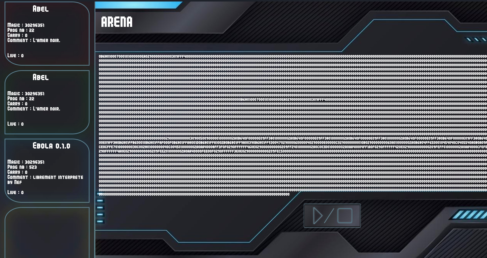

#  Corewar

##  What's Corewar ? 🤔

<small>*(Takes a badass voice)*</small>
In a remote area of living memory, illegal battles were being fought. Glorious strategists offered their most skilful warriors to conquer the entire memory that the organizers had carefully isolated. And so these battles have continued from generation to generation.
[PROMPT] Generate an image of a rugged, distant land where skilled warriors prepare for illegal battles to conquer isolated memories, with a somber and intense atmosphere reflecting the gravity of the situation.

Here are the criteria for an unforgettable battle ⚔️

[PROMPT]
-  **The Virtual Machine**<br/>
It houses the fighting binary programs (called champions), and provides them with a standard execution environment. It offers all kind of features that are useful to the champions’ fights. It must obviously be able to execute several programs at once.. .

[PROMPT] Create an image of a muscular person assembling two blocks of memory using ropes.
-  **The Assembler**<br/>
It enables you to write programs designed to fight (the champions). It therefore understands the assembly language and generates binary programs that the virtual machine can execute.

[PROMPT]
-  **Champions**<br/>
This is your personal handiwork. They must be able to fight and to victoriously leave the virtual machine arena. They are written in the assembly language specific to our virtual machine (described further on).


**This year, we were the organizers of the 42nd battle of the year ! We divided the organization into two parts to make this battle go as smoothly as possible**

##  Part I - ASM

###  Statistics

| Category                  | Percentages | Tests | No Crash |
|---------------------------|-------------|-------|----------|
| ASM, Header               | 0%          | 0/3   | ❌       |
| ASM, Full header          | 0%          | 0/5   | ❌       |
| ASM, valid bytecode cases | 0%          | 0/18  | ✅       |
| ASM, invalid cases        | 100%        | 35/35 | ✅       |
| ASM, real champion        | 0%          | 0/5   | ✅       |
| **Total**                 | **53%**     | **35/66**

## Usage

```bash
  make re
  ./asm/asm <champion.s>
```
# Part II - Virtual Machine

*⚠️ The virtual machine part is corrected manually and is therefore not noted below*

## Usage

```bash
  make re
  ./corewar/corewar <champion.cor> <champion.cor> <champion.cor> <champion.cor>
```

### Bonus - Graphical Window

```bash
  cd bonus/
  make re
  ./bonus_corewar -g <champion.cor> <champion.cor> <champion.cor> <champion.cor>
```



# Contributors

- [0yco](https://github.com/0yco) (Virtual Machine | User Interface)
- [Lunnos](https://github.com/LunnosMp4) (Virtual Machine)
- [Nico-coder-ui](https://github.com/Nico-coder-ui) (ASM)
- [Hugo Eschlimann](https://github.com/HugoEschlimann) (ASM)