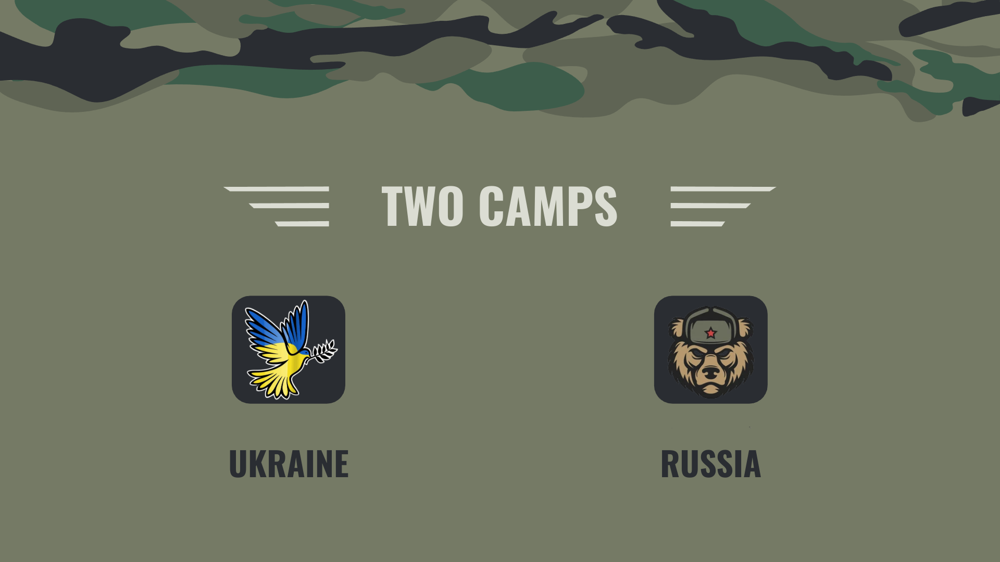
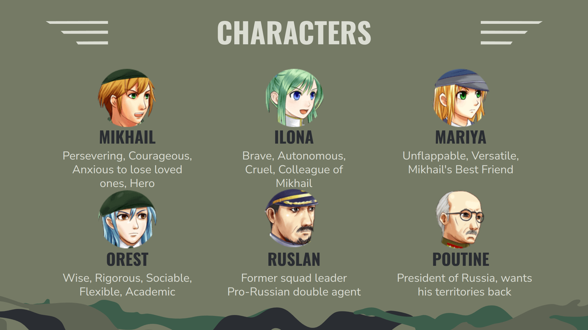
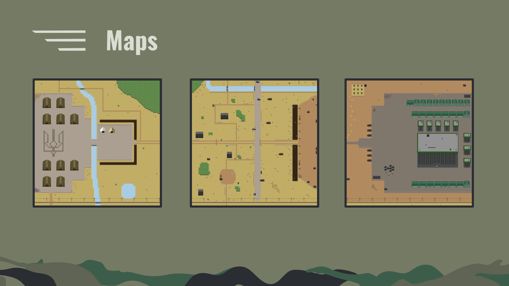

# RPG

Get ready for the biggest and most stylish project of the year !!!!

##  Usage
```bash
make re

./my_rpg
```

## Contributors

-  [0yco](https://github.com/0yco)

-  [Lunnos](https://github.com/LunnosMp4)

-  [Nico-coder-ui](https://github.com/Nico-coder-ui)

-  [Lysandra](https://github.com/Lysandra26)

## Presentation








