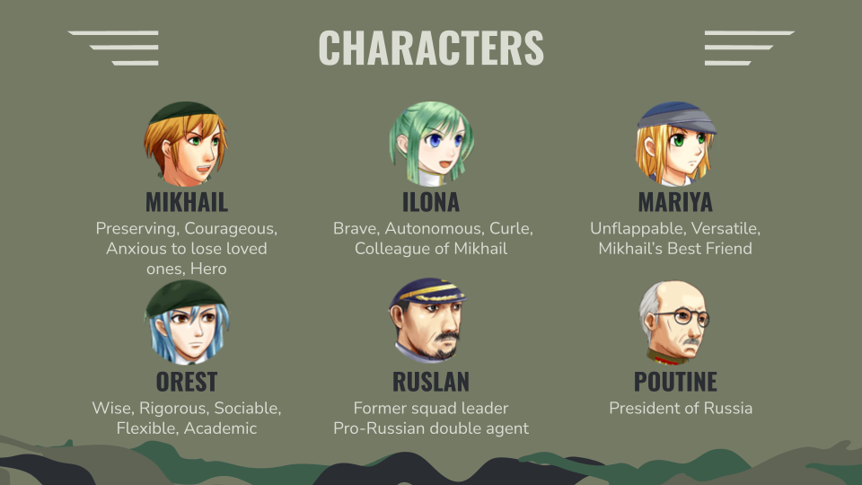
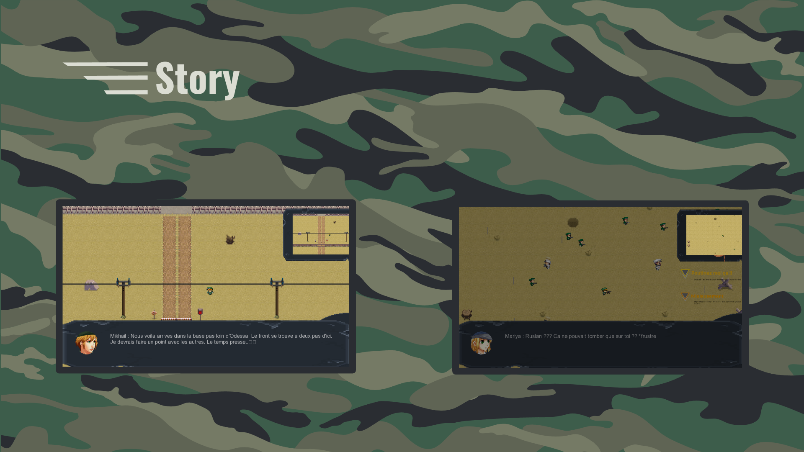
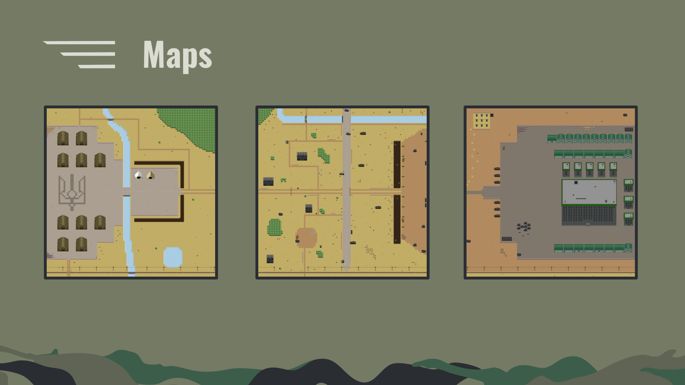

# RPG

Get ready for the biggest and most stylish project of the year !!!!

##  Usage
```bash
make re

./my_rpg
```

## 🚀 Overview






## 👥 Contributors

-  [0yco](https://github.com/0yco)
-  [Lunnos](https://github.com/LunnosMp4)
-  [Thorf1nn](https://github.com/Thorf1nn)
-  [Lysandra](https://github.com/Lysandra26)
