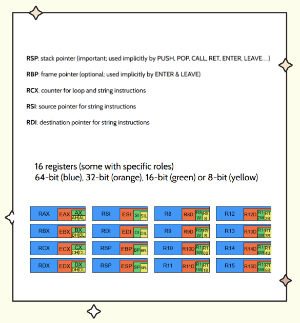
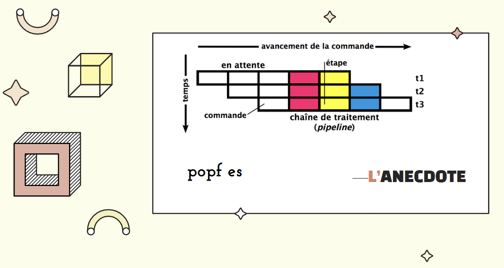
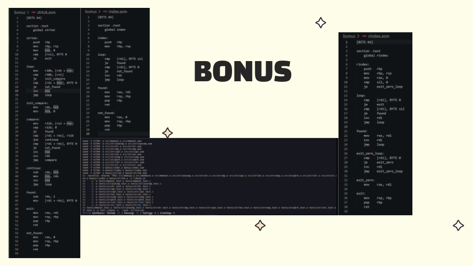

# 🧩 ASM Minilib C

## 🚀 Overview

Le projet **ASM Minilib C** consiste à réimplémenter certaines fonctions de la bibliothèque standard du langage C en utilisant l'assembleur x86-64

## 📚 Fonctions implémentées

Voici la liste des fonctions réimplémentées, accompagnées de leur taille respective en octets et d'une brève description :

| Fonction    | Taille (octets) | Description |
|-------------|-----------------|-------------|
| `memcpy`    | 333             | Copie un bloc de mémoire d'une adresse à une autre. |
| `memmove`   | 537             | Copie un bloc de mémoire en gérant le chevauchement des zones mémoire. |
| `memset`    | 307             | Remplit une zone mémoire avec une valeur spécifique. |
| `strcasecmp`| 706             | Compare deux chaînes de caractères sans tenir compte de la casse. |
| `strchr`    | 387             | Recherche la première occurrence d'un caractère dans une chaîne. |
| `strcmp`    | 417             | Compare deux chaînes de caractères. |
| `strcspn`   | 492             | Calcule la longueur maximale d'un segment sans certains caractères. |
| `strlen`    | 281             | Retourne la longueur d'une chaîne de caractères. |
| `strncmp`   | 578             | Compare les premiers `n` caractères de deux chaînes. |
| `strpbrk`   | 582             | Recherche le premier caractère d'une chaîne présent dans une autre chaîne. |
| `strrchr`   | 557             | Recherche la dernière occurrence d'un caractère dans une chaîne. |
| `strstr`    | 761             | Recherche une sous-chaîne dans une chaîne de caractères. |