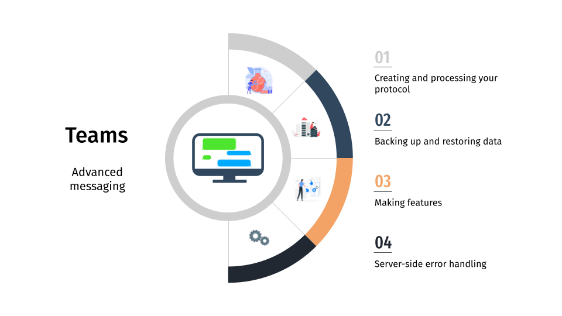

## 🚀 Overview

## 🛅 Techniques and Protocols

This section describes the protocol used by the server and the client.

### Usage

* **Client Command:** `/command arg1 arg2 ... argN`
* **Protocol Format:** `CODE_FUNCTION BWA arg1 arg2 ... argN\n`
* **Server Response:** `CODE_RESPONSE BWA MESSAGE BWA arg1 arg2 ... argN\r\n`

### Example

* **Client Command:** `/login Lunnos`
* **Protocol Format:** `01 BWA Lunnos\n`
* **Server Response:** `101 BWA Login Successful BWA UUID Lunnos\r\n`

### Codes

* **CODE_FUNCTION:** Two-digit numbers ranging from 01 to 14
* **CODE_STATUS:** 
    * 1: Success
    * 2: Error
    * 3: Unauthorized
    * 4: Unknown
* **CODE_RESPONSE:** Combination of `CODE_STATUS` and `CODE_FUNCTION`

### Function Codes

* **01:** Login
* **02:** Logout
* **03:** Message
* **04:** Send
* **05:** Subscribe
* **06:** Unsubscribe
* **07:** Subscribed
* **08:** Use
* **09:** User
* **10:** Users
* **11:** Create
* **12:** Info
* **13:** List
* **14:** Help

**Note:** `00` is reserved for common responses.
* **200:** Bad Request (Wrong arguments)
* **300:** Unauthorized (User not logged in)

## 👥 Contributors

-  [0yco](https://github.com/0yco)
-  [Lunnos](https://github.com/LunnosMp4)
