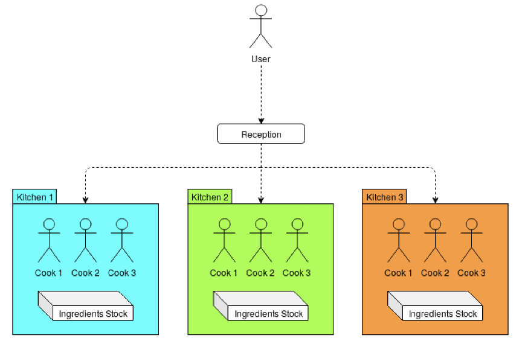

# 🍕 The Plazza - Pizzeria Simulation

## 📌 Description

**The Plazza** is a pizzeria simulation where a reception manages incoming orders and distributes them to multiple kitchens. Each kitchen has a limited number of cooks preparing pizzas using available ingredients. The project addresses challenges such as **load balancing, process and thread synchronization, and inter-process communication**.

## 🚀 Usage

Run the program with the following command:
```bash
./plazza <cookingTime> <nCooks> <refillTime>
```
- **cookingTime** → Multiplier for actual pizza cooking time (value between 0 and 1).
- **nCooks** → Number of cooks per kitchen.
- **refillTime** → Time (in ms) required for kitchens to restock ingredients.

## 🏗️ Architecture

The project is divided into several independent components:

### 🏠 Core
The **Core** class is responsible for managing all parts of the project together. It handles:
- Order distribution to kitchens.
- Kitchen lifecycle (creation and destruction based on demand).
- Communication between different components.



### 🍽️ Kitchens
Each **kitchen** operates as its own **process** and contains:
- A fixed number of **cooks** (defined by `nCooks`).
- An **ingredient stock**, which is replenished periodically.
- A mechanism to **automatically open and close** kitchens based on real-time demand.

### 👨‍🍳 Cooks
Each **cook** runs as an **individual thread** inside a kitchen. Their responsibilities include:
- Taking available orders.
- Preparing pizzas using the kitchen’s ingredient stock.
- Managing cooking time based on the defined `cookingTime` multiplier.

### 🥦 Ingredients
Ingredients are managed through the **IIngredients** interface (`./src/ingredients`).
Each ingredient:
- Has a **type** (`std::string _type`), accessible via `getType()`.
- Has a **unit count** (`int _units`), representing the available stock.
- Can be **consumed** via `consumeUnit()`.
- Can be **refilled** (up to 5 units) when the kitchen triggers `refill()`.

## 🎮 Interactive Shell

The reception acts as an interactive shell, allowing you to:
- **Place pizza orders** via command line, e.g.:
  ```
  regina XXL x7
  ```
- **Check kitchen status**, including active cooks and ingredient stock:
  ```
  status
  ```

## 🛠️ Technologies Used
- **Processes** (fork, exit, wait...)
- **Inter-Process Communication (IPC)**
- **STL Threads & POSIX Threads (pthread_*)**

## 🎯 Objective
Ensure efficient resource management and optimized order processing to keep the pizzeria running smoothly! 🍕🔥
