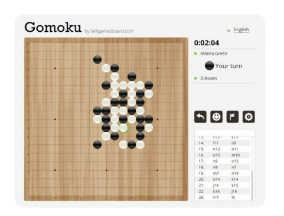

# 🧠 Gomoku - Smart Bots for a Simple Game

---

## 🚀 Overview

**Gomoku** challenges you to create an AI bot for the classic Gomoku game (also known as Wuzi Qi, Five in a Row). Develop a bot that smartly analyzes the board, makes optimal moves, and wins by aligning five stones in a row on a 20×20 grid. Your bot must adhere to a mandatory communication protocol and is pitted against other bots to prove its strategic strength. Challenge local bots and rise to tournament glory! 🤖🏆



---

## 🔧 Setup Guide

### 📦 Compilation

- **Requirements**:
  - Linux environment.
  - Only standard libraries (no external AI libraries like TensorFlow or scikit-learn).
  - A Makefile for compilation.

- **Build the Bot**:
  ```bash
  make
  ```

- **Cleanup**:
  ```bash
  make clean      # Remove temporary and object files
  make fclean     # Remove binaries and all generated files
  ```

### 🏃 Running the Bot

- **Execute the Binary**:
  ```bash
  ./pbrain-gomoku-ai
  ```
- Ensure your bot communicates using the mandatory protocol for interacting with game engines like liskvork.

### 🖥️ Running on Windows

- **Piskvork Setup**:
  - Download and install Piskvork from [SourceForge](https://sourceforge.net/projects/piskvork/).
  - Place your AI bot executable `pbrain-gomoku-ai-[version].exe` in the Piskvork directory.
  - Configure Piskvork to use your bot for playing Gomoku.

This allows you to test and play against your AI bot on a Windows environment using Piskvork.

---

## 🌟 Project Description

This project centers on developing an AI bot that plays Gomoku. Your bot should:

- **Analyze Game Situations**: Evaluate the board and identify winning moves.
- **Implement Advanced Algorithms**: Use techniques such as Minimax, Monte-Carlo simulations, or any innovative algorithm of your choice.
- **Manage Game Rules**: Efficiently handle board representation and enforce game rules on a 20×20 grid.
- **Optimize Performance**: Decide moves within 5 seconds and operate within a 70 MB memory limit.

Your performance in actual gameplay against local bots is the ultimate measure of success.

---

## 📂 Project Structure

- **Source Files**: All necessary source code files for the bot.
- **Makefile**: To compile, clean, and rebuild your project.
- **bonus/**: Directory for any bonus files or extra features.
- **Documentation**: Detailed documentation of your AI strategy is highly encouraged.

---

## 🏆 Evaluation Criteria

Your bot will be judged on:

- **Winning Strategy** 🏅: Ability to detect winning moves and play optimally.
- **Efficiency** ⚡: Making decisions within the 5-second limit.
- **Resource Management** 📏: Adhering to the 70 MB memory constraint.
- **Protocol Compliance** 🔒: Following the mandatory communication protocol; forbidden moves or libraries lead to disqualification.

Document your approach to demonstrate the intelligence behind your bot!
