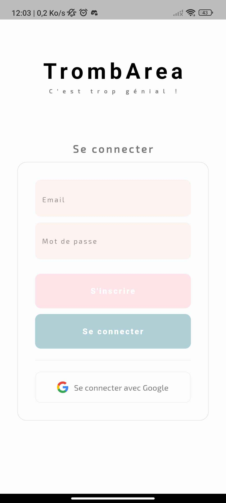
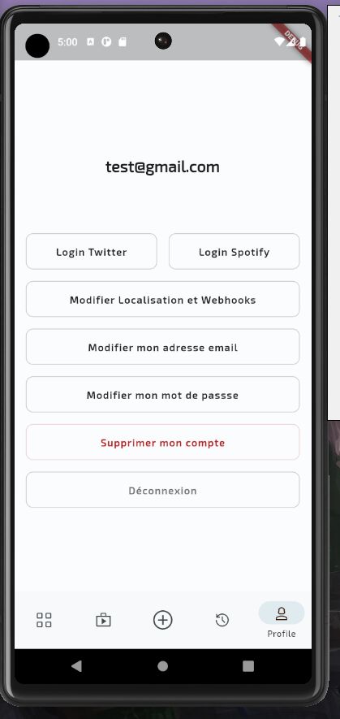
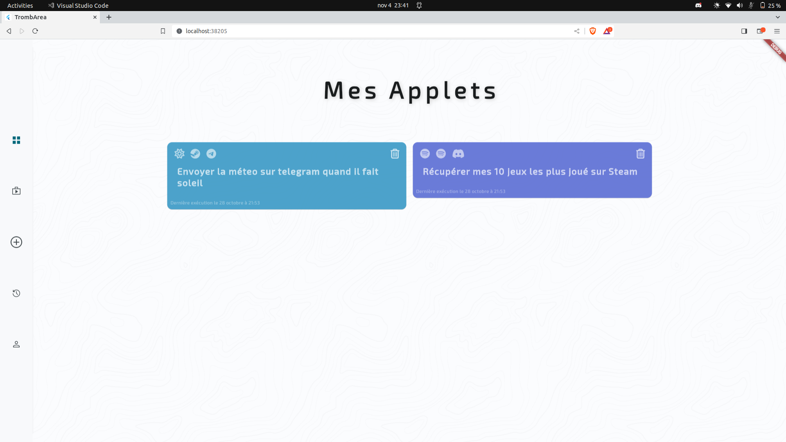
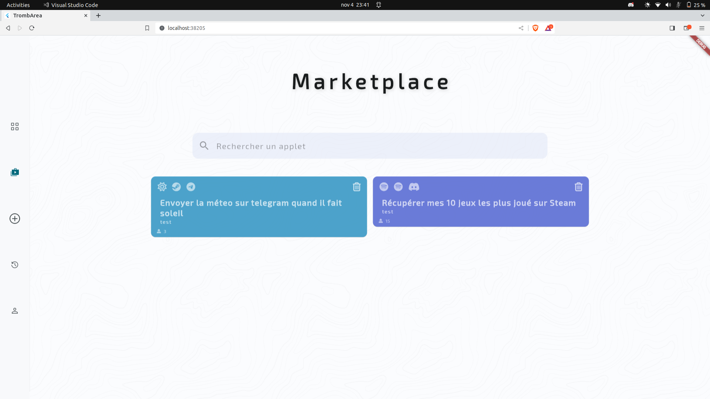
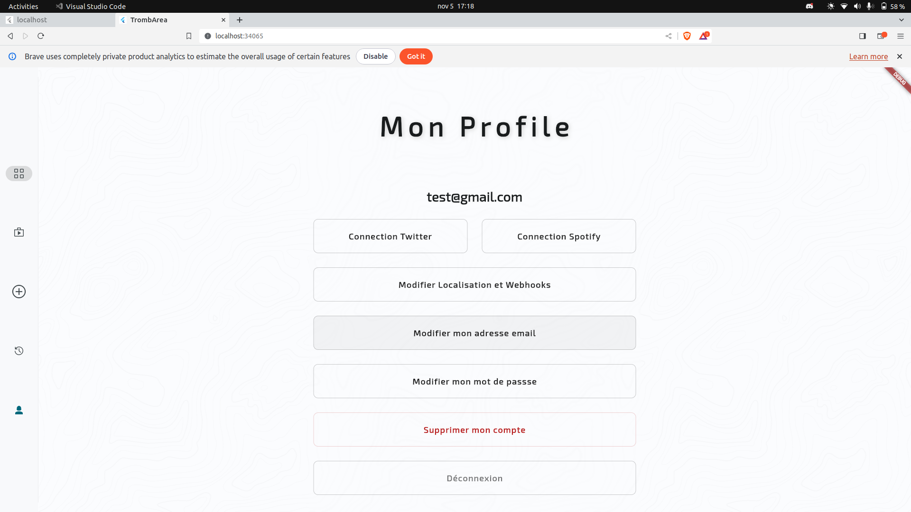

# 🌐 TrombArea - Automate Your Digital Life

---

## 🚀 Overview

**TrombArea** is an automation platform that empowers you to streamline your digital life by connecting various services in custom workflows—similar to IFTTT or Zapier. This platform consists of an application server, a web client, and a mobile client, which work together to offer a seamless automation experience through a REST API. 🤖🔄

---

## 📖 Project Description

### 1. The Project

The goal of TrombArea is to explore and implement a complete software platform by developing a business application. You will create a suite of software that functions similarly to IFTTT/Zapier, divided into three main parts:

- **Application Server**: Implements all the business logic and features.
- **Web Client**: Provides a user interface accessible via a web browser that communicates with the server.
- **Mobile Client**: Offers mobile access to the application via REST API calls.

*Note: No business processes are executed on the web or mobile clients; they serve solely as user interfaces redirecting requests to the application server.*

### 2. Features

TrombArea offers the following functionalities:

- **User Registration**: Users sign up to create an account.
- **Account Confirmation**: Registered users confirm their accounts before using the application.
- **Service Subscription**: Authenticated users subscribe to various services.
- **Components per Service**:
  - **Action Components**: Trigger events (e.g., new email received, file uploaded).
  - **REAction Components**: Define responses (e.g., save attachment, post message).
- **AREA Creation**: Users compose custom workflows by linking an Action with a REAction.
- **Automatic Triggers**: The application automatically triggers workflows based on predefined conditions.

---

## 🗎 Documentations

We have a documentation in the [docs/](./docs/) that you can open with live server [index.html](./docs/index.html)

---

## 💻 Functions & API

### Core Functions

- **User Management**: Registration, account confirmation, and administration.
- **Service Subscription**: Users link their accounts to external services.
- **Action & REAction Execution**: Custom workflows trigger responses based on events.
- **Real-Time Triggering**: The server continuously monitors for conditions to activate workflows.

## 🏆 Evaluation Criteria

TrombArea will be evaluated based on:

- **Integration & Functionality**: Smooth interaction between server, web, and mobile clients.
- **User Experience**: Intuitive interfaces and adherence to accessibility standards.
- **Automation Efficiency**: Accurate and timely execution of triggers and workflows.
- **Code Quality & Documentation**: Clean, maintainable code with comprehensive documentation.

## 👥 Contributors

-  [WilliamAndreo](https://github.com/WilliamAndreo)
-  [0yco](https://github.com/0yco)
-  [LunnosMp4](https://github.com/LunnosMp4)
-  [Nico-coder-ui](https://github.com/Nico-coder-ui)
-  [ArnauldT](https://github.com/ArnauldT)
